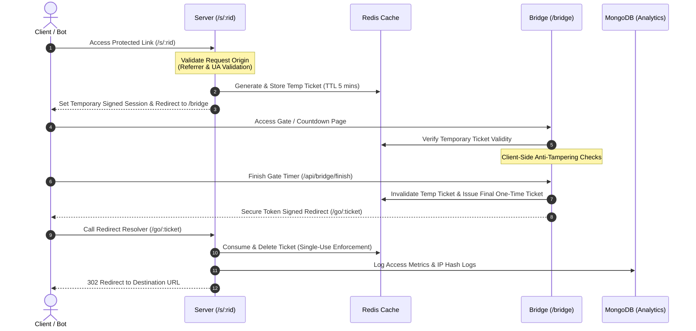

# 🛡️ ShieldRoute: Enterprise-Grade Link Protection & Anti-Bypass Proxy Gate

ShieldRoute is a high-performance link-gating and security proxy system designed to protect monetized destination links from automated web scrapers, bypass extensions, and bot extraction.

*Note: This repository contains the system architecture, database design patterns, and engineering documentation for ShieldRoute. The core source code is proprietary.*

---

## 🏗️ System Architecture & Redirection State Machine

ShieldRoute ensures that final destination URLs are never exposed in frontend scripts, server logs, or intermediate page HTML.

---

## 🔐 Special Authentication & User Onboarding Mechanisms

To prevent fake registrations and ensure high platform integrity, ShieldRoute employs several specialized authentication flows:

### 1. Dual-Method Authentication (Password & Passwordless OTP)
*   **Password Login:** Standard credential validation matching cryptographically hashed passwords (`sha256` with custom `HASH_SALT` configuration).
*   **Passwordless Email OTP:** Users can request a one-time 6-digit verification code sent to their registered email. The OTP is stored in Redis with a 5-minute TTL to enforce fast expiry.

### 2. Razorpay Automated Payment Gateway & Billing
*   **Checkout Flow:** Integrated **Razorpay API** to handle automated subscriptions, generating dynamic payment orders and opening standard checkout forms.
*   **Webhook Signature Verification:** Uses secure webhooks with SHA-256 HMAC verification to process payment success/failure events dynamically, updating the user's subscription tier on callback.
*   **Transaction Logging:** Integrates directly with the billing engine to transition pending accounts to active instantly, logging Razorpay payment IDs, order IDs, and payment responses to MongoDB.
*   **Fallback Mailer Notifications:** Fires automated SMTP receipts and trial activation confirmations instantly upon successful payment completion.

### 3. Dynamic Credential Pre-filling & Auto-routing
*   Upon successful registration and OTP confirmation, the frontend dynamically switches the active panel state and pre-fills the login form with the verified username, maximizing user experience.

---

## ⚡ Engineering & Architecture Achievements (Portfolio Highlights)

*   **State-Machine Redirect Validation:** Built a multi-step token validation flow (`/s/:rid` ➔ `/bridge` ➔ `/go/:ticket`) that completely removes destination URLs from the DOM, thwarting automated bypass browser extensions.
*   **High-Speed Caching Layer:** Selected **Redis** for transient state (caching short-lived redirect tickets, rate-limiting, and email OTPs) ensuring sub-millisecond response times.
*   **Dual-Database Strategy:** Paired Redis with **MongoDB** for long-term analytics logs, audit tracking, referrer configurations, and billing history.
*   **IP-Fingerprint Tampering Detection:** Checks request headers (User-Agent, IP hashes) at both validation gates to catch and block ticket reuse or spoofing.

---

## ⚙️ Technology Stack & Hosting
*   **Backend Runtime:** Node.js (Express)
*   **Caching & State Storage:** Redis
*   **Data Persistence:** MongoDB
*   **View Engine:** EJS (Dynamic server-rendered HTML layouts)
*   **Email Engine:** SMTP (Nodemailer)
*   **Production Deployment:** Hosted on Ubuntu Linux VPS, managed via PM2 process supervisor, with dynamic robots/sitemap compliance.
