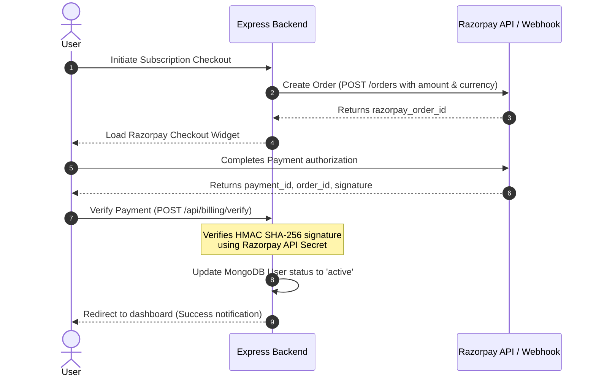

# ⚙️ System Design & Schema Architecture

This document outlines the detailed system design, database schemas, and state validation configurations used in **ShieldRoute**.

---

## 💾 Database Schema Design

### 1. Redis Caching Tier (In-Memory Key-Value Stores)
Used for transient state, rate-limiting, and short-lived redirection tickets.

| Key Pattern | Data Type | TTL | Purpose |
| :--- | :--- | :--- | :--- |
| `ticket:temp:{rid}` | String (Token) | 5 minutes | Generated when a user visits `/s/:rid`. Verifies page transition integrity. |
| `ticket:final:{token}` | String (JSON metadata) | 1 minute | Issued after completing countdown. One-time usage destination ticket. |
| `otp:{email}` | String (6-digit code) | 5 minutes | Email verification OTP for passwordless login and account registration. |
| `sess:{session_id}` | JSON | 24 hours | Session object for authenticated administrators and users. |

### 2. MongoDB Tier (Persistent Collections)
Stores users, subscriptions, configurations, and long-term event logs.

#### Users Collection (`users`)
```json
{
  "_id": "ObjectId",
  "username": "String (Unique)",
  "passwordHash": "String (SHA-256)",
  "email": "String",
  "status": "String (pending / approved / expired)",
  "createdAt": "ISODate",
  "subscription": {
    "planId": "String",
    "expiresAt": "ISODate",
    "razorpayOrderId": "String",
    "razorpayPaymentId": "String",
    "razorpaySignature": "String",
    "status": "String (active / inactive)"
  }
}
```

#### Logs Collection (`stats`)
```json
{
  "_id": "ObjectId",
  "rid": "String",
  "ipHash": "String (SHA-256 anonymized)",
  "userAgent": "String",
  "status": "String (legitimate / bypassed)",
  "timestamp": "ISODate"
}
```

---

## 🔒 Deep Dive: Anti-Bypass Mechanics

Typical URL protectors are vulnerable to scripts that simply read the redirect URL from the page source or jump directly to the target routing endpoint. ShieldRoute prevents this via:

1.  **Ticket Rotation:** Every step of the redirection flow demands a valid, single-use ticket signed with a cryptographically secure hash.
2.  **Stateful Verification:** `/go/:ticket` checks whether the final ticket matches the client's current IP fingerprint and session identity.
3.  **Strict Ticket Consumption:** The moment a final ticket is resolved, it is immediately deleted from Redis. Any attempt to reuse the ticket triggers an instant alert and redirects the IP to the blocked access screen.

---

## 💳 Razorpay Automated Billing Flow


